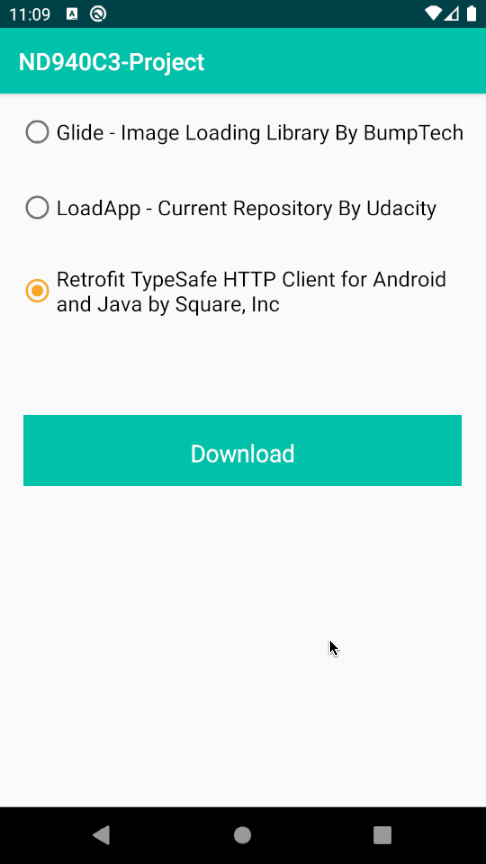
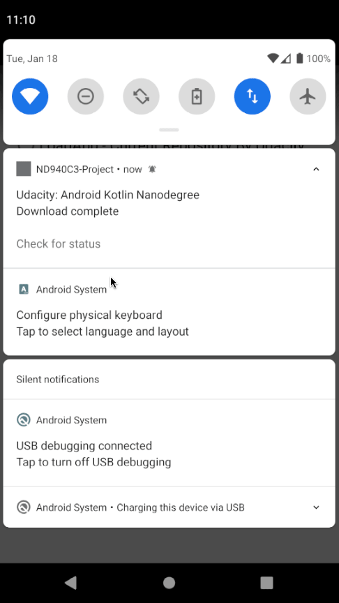

# LoadApp

In this project you will find an app to download 3 project files:
- Glide - Image Loading Library By BumpTech
- LoadApp  - Current Repository
- Retrofit TypeSafe HTTP Client for Android and Java by Square, Inc

**This app showcases notification usage and animation through motion layout and through a custom view.**

Once the user has click the button to download, an animation starts (all of the code is in the LoadingButton class):

If the users clicks on the notification or on the action button, he gets to the detail screen, showing off detail of the file:

## Built With

* [Android Studio](https://developer.android.com/studio) - Default IDE used to build android apps
* [Kotlin](https://kotlinlang.org/) - Default language used to build this project

Include all items used to build project.

## License
Please review the following [license agreement](https://bumptech.github.io/glide/dev/open-source-licenses.html)
